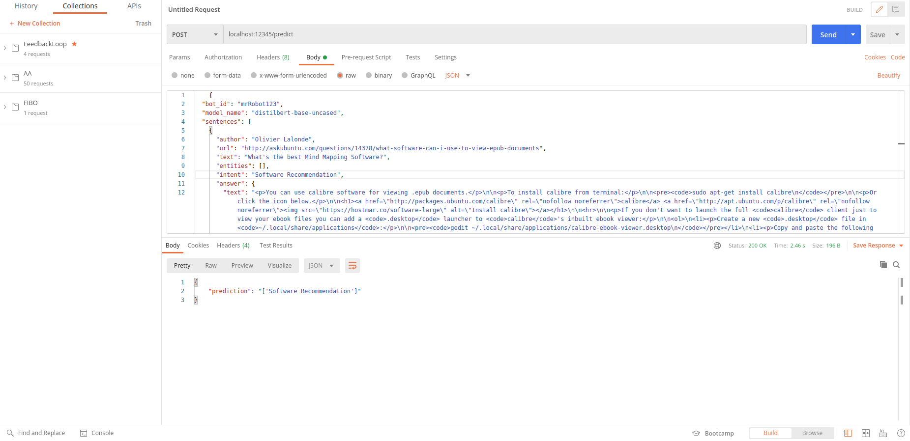

# intent_classifier
A simple API that allows chatbot users to train intent classification models as a service using personal data.

## Installation (local)

* Activate a virtual environment (this version was tested with python 3.6)

* Install requirements
```
pip install -r requirements.txt
```
---

* Start the service in the virtual environment using the command
```
python app.py
```
---

**NOTE:**
The present version was tested with CUDA 10.1 and the following torch installation: ___conda install pytorch==1.7.1 torchvision==0.8.2 torchaudio==0.7.2 cudatoolkit=10.1 -c pytorch___

---

## Assumptions
The following assumptions have been made considering the scope of the development of this project:

* This is an unrestricted service, as such it has bene designed to be as generic as possible for customer use.
* The service supposes different end-users and therefore different chatbots. For that reason, a chatbot will be explicitely identified by its **chatbot_id** key.
* Since the functionality of this service is general purpose, we pre-suppose the possibility of serving multiple models. The service has been developed in that mindset even if the sample run only illustrates a single model. A model will be identified by its **model_name** key.
* Since the scope of this service is large, we presuppose a wide array of datasets for its use. The service has been developed in a way to normalize any incoming dataset based on a sample dataset model that has been selected for the sample run (the service is developed in a way to be extended however to different datasets encompassing chatbot intent information). A dataset will be identified by a list of **sentences** containing _text_ and _intent_ objects to perform classification.
* Because this service is meant to be deployed in the cloud, it has been set up using Flask for portability. It can easily be deployed on-premise or on the cloud.
* Since the service is an API, we consider input in the form of JSON objects. A sample JSON object for this service is of the form:
```json
{
  "bot_id": "mrRobot123",
  "model_name": "distilbert-base-uncased",
  "sentences": [
    {
      "author": "Olivier Lalonde",
      "url": "http://askubuntu.com/questions/14378/what-software-can-i-use-to-view-epub-documents",
      "text": "What software can I use to view epub documents?",
      "entities": [],
      "intent": "Software Recommendation",
      "answer": {
        "text": "<p>You can use calibre software for viewing .epub documents.</p>\n\n<p>To install calibre from terminal:</p>\n\n<pre><code>sudo apt-get install calibre\n</code></pre>\n\n<p>Or click the icon below.</p>\n\n<h1><a href=\"http://packages.ubuntu.com/calibre\" rel=\"nofollow noreferrer\">calibre</a> <a href=\"http://apt.ubuntu.com/p/calibre\" rel=\"nofollow noreferrer\"></a></h1>\n\n<hr>\n\n<p>If you don't want to launch the full <code>calibre</code> client just to view your ebook files you can add a <code>.desktop</code> launcher to <code>calibre</code>'s inbuilt ebook viewer:</p>\n\n<ol>\n<li><p>Create a new <code>.desktop</code> file in <code>~/.local/share/applications</code>:</p>\n\n<pre><code>gedit ~/.local/share/applications/calibre-ebook-viewer.desktop\n</code></pre></li>\n<li><p>Copy and paste the following passage into the file:</p>\n\n<pre><code>#!/usr/bin/env xdg-open\n\n[Desktop Entry]\nVersion=1.0\nType=Application\nTerminal=false\nIcon=calibre\nExec=ebook-viewer\nName=Calibre Ebook Viewer\nComment=Display .epub files and other ebook formats\nMimeType=application/x-mobipocket-ebook;application/epub+zip;\nStartupWMClass=calibre-ebook-viewer\n</code></pre></li>\n<li><p>Save the file. You should now be able to launch Calibre's inbuilt ebook viewer both from the dash and through the right click \"Open with\" menu.</p></li>\n</ol>\n",
        "author": "karthick87"
      }
    },
    {
      "author": "NES",
      "url": "http://askubuntu.com/questions/18495/which-pdf-viewer-would-you-recommend",
      "text": "Which PDF Viewer would you recommend?",
      "entities": [],
      "intent": "Software Recommendation",
      "answer": {
        "text": "<p>Here are some well known PDF readers:</p>\n\n<ul>\n<li><a href=\"https://www.foxitsoftware.com/products/pdf-reader/\" rel=\"noreferrer\"><strong>Foxit Reader</strong></a> - View, create, convert, annotate, print, collaborate, share, fill forms and sign.</li>\n<li><a href=\"http://packages.ubuntu.com/xpdf\" rel=\"noreferrer\"><strong>xpdf</strong></a> - <a href=\"http://apt.ubuntu.com/p/xpdf\" rel=\"noreferrer\">Install xpdf</a> \"Xpdf is a small and efficient program which uses standard X fonts\". Lightweight, but with outdated interface.</li>\n<li><a href=\"http://packages.ubuntu.com/evince\" rel=\"noreferrer\"><strong>evince</strong></a> - <a href=\"http://apt.ubuntu.com/p/evince\" rel=\"noreferrer\">Install evince</a> Evince is a document viewer for multiple document formats. Used by default on Gnome.</li>\n<li><a href=\"http://packages.ubuntu.com/kpdf\" rel=\"noreferrer\"><strong>kpdf</strong></a> - <a href=\"http://apt.ubuntu.com/p/kpdf\" rel=\"noreferrer\">Install kpdf</a> KPDF is a pdf viewer based on xpdf for KDE 3.</li>\n<li><a href=\"http://packages.ubuntu.com/gv\" rel=\"noreferrer\"><strong>gv</strong></a> - <a href=\"http://apt.ubuntu.com/p/gv\" rel=\"noreferrer\">Install gv</a> - an old lightweight pdf viewer with an old interface. Size of the package is only 580k. gv is an X front-end for the Ghostscript PostScript(TM) interpreter.</li>\n<li><a href=\"http://packages.ubuntu.com/okular\" rel=\"noreferrer\"><strong>okular</strong></a> - <a href=\"http://apt.ubuntu.com/p/okular\" rel=\"noreferrer\">Install okular</a> - KDE pdf viewer, requires many KDE prerequisites. Can easily copy text and images.</li>\n<li>acroread - Adobe Acrobat Reader, no longer supported for Linux by Adobe, seems to be no longer supported by Ubuntu.</li>\n</ul>\n\n<p>Note that most Linux PDF viewers <a href=\"https://www.linux.com/news/software/applications/792447-3-alternatives-to-the-adobe-pdf-reader-on-linux/\" rel=\"noreferrer\">don't provide</a> the advanced capabilities of PDF.</p>\n",
        "author": "karthick87"
      }
    }
  ]
}
```

## Functionality

Tha API has 2 endpoints:
    
    /train
This is the request to perform training on a chatbot. To invoke this service navigate to: _localhost:12345/train_.

Mandatory parameters are:
* **bot_id:** string representation of the chatbot identifier.
* **model_name:** string name of classification model. For this version, HuggingFace models have been considered but are easily extensible to other machine or deep learning models. 
* **sentences:** a list of objects containing natural language text and its corresponding intent. This will constitute the dataset that will be split into training and test sets within the service in a seamless way for the user. The data is also resampled prior to splitting to ensure every intent is represented in both splits.

The API returns an error if any one of these parameters is missing.

The service is designed in a generic manner to cater for different models based on the name (similarly to the HuggingFace API) and can be extended to fall back on default models.

If the training is successful, a message is returned indicating the training is successfully completef. A resource is also created on the server where the model is stored for the specific chatbot. That model can be loaded and used for predictions.

Here is a sample run in Postman. The sample data used is _data/sample_train.json_.


    /predict
This is the request to perform prediction on new data. The input is a natural language text and the prediction is an intent. To invoke this service navigate to: _localhost:12345/predict_.

Mandatory parameters are:
* **bot_id:** string representation of the chatbot identifier.
* **model_name:** string name of classification model. For this version, HuggingFace models have been considered but are easily extensible to other machine or deep learning models. 
* **sentences:** a list of objects containing natural language text that needs to be classified as intent.

The API returns an error if any one of these parameters is missing.

If the model doesn't exist, the service will return an error message stating that no such model can be found. This case requires making a **/train** request before performing predictions.

If the prediction is successful, the service returns a message contaaining the list of predicted intents for the input texts.

Here is a sample run in Postman. The sample data used is _data/sample_predict.json_.



## Enhancements

This version is designed as a proof-of-concept and has been tested on a sample run using very small datasets because of hardware memory constraints. It is by no means a finalized version of the service yet it contains the major components to scale it. Some interesting enhancements may be:
* Packaging the service (using Docker) for easier deployment.
* Extending the available models.
* Adding a GUI for easier dataset upload.
* Extending to more datasets.
* Catering for different models using a cloud repository (ElasticSearch, AWS) or a dedicated database to avoid managing many resource directories on the cloud.
* Tackling data imbalance: the present version undersamples to the least represented intent, but other methods can be implemented before the training/test split.
* Tackling encoding issues: normalizing the datasets since the input text is received in natural language.

## References

* [Fine-tuning with custom datasets](https://huggingface.co/transformers/custom_datasets.html)
* [Hugging Face on Amazon SageMaker Workshop](https://github.com/C24IO/SageMaker-HuggingFace-Workshop)
* [Turning Machine Learning Models into APIs in Python](https://www.datacamp.com/community/tutorials/machine-learning-models-api-python)
* [Know your Intent : Intent Classification Datasets](https://github.com/kumar-shridhar/Know-Your-Intent/blob/master/datasets/NLU-Evaluation-Corpora/AskUbuntuCorpus.json)